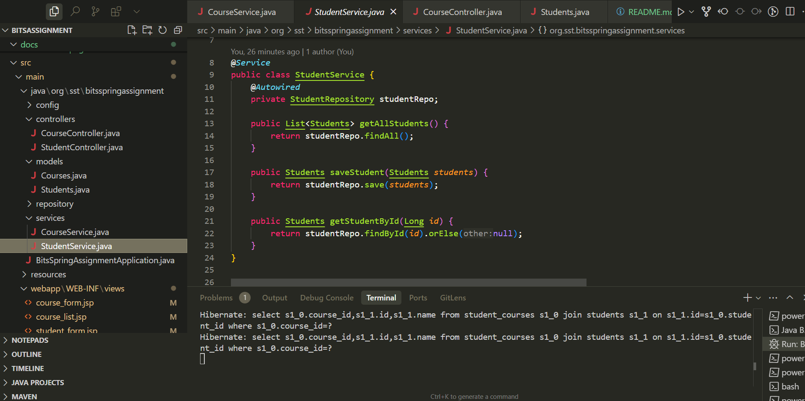

# Student-Course Management System

A Spring Boot application for managing students and their course enrollments. This system allows administrators to manage students, courses, and their relationships in a many-to-many relationship.

## Screenshots

### Student Management

*Student list view with course enrollments*


*Add/Edit student form with course selection*

### Course Management

*Course list view with enrolled students*


*Add/Edit course form*

### Service Implementation

*Student service implementation with business logic*


*Course service implementation with business logic*

## Thought Process

### Problem Analysis
- Need to manage students and their course enrollments
- Students can enroll in multiple courses
- Courses can have multiple students
- Need to track these relationships efficiently
- Need a user-friendly interface for management

### Design Decisions
1. **Database Design**
   - Many-to-many relationship between Students and Courses
   - Junction table for managing enrollments
   - Simple but effective entity structure

2. **Technology Stack**
   - Spring Boot for robust backend
   - JPA/Hibernate for ORM
   - JSP for view templates
   - Bootstrap for responsive UI
   - H2 database for development

3. **Architecture**
   - MVC pattern
   - Repository pattern for data access
   - Service layer for business logic
   - Controller layer for request handling

## ERD Diagram


## Implementation Steps

1. **Project Setup**
   - Created Spring Boot project with required dependencies
   - Configured application.properties
   - Set up project structure

2. **Entity Creation**
   - Created Student entity
   - Created Course entity
   - Established many-to-many relationship

3. **Repository Layer**
   - Created StudentRepository
   - Created CourseRepository
   - Implemented custom queries

4. **Service Layer**
   - Implemented StudentService
   - Implemented CourseService
   - Added business logic

5. **Controller Layer**
   - Created StudentController
   - Created CourseController
   - Implemented CRUD operations

6. **View Layer**
   - Created JSP templates
   - Implemented Bootstrap styling
   - Added form validation

7. **Testing**
   - Implemented unit tests
   - Tested repository layer
   - Tested service layer

## Installation Steps

### Prerequisites
- Java 17 or higher
- Maven
- IDE (IntelliJ IDEA, Eclipse, or VS Code)

### Setup Instructions

1. **Clone the Repository**
   ```bash
   git clone <repository-url>
   cd student-course-management
   ```

2. **Configure Database**
   - The application uses H2 database by default
   - Configuration is in `application.properties`

3. **Build the Project**
   ```bash
   mvn clean install
   ```

4. **Run the Application**
   ```bash
   mvn spring-boot:run
   ```

5. **Access the Application**
   - Open browser and navigate to `http://localhost:8080`
   - Student list will be displayed by default

## Features

### Student Management
- View all students
- Add new students
- Edit existing students
- Assign courses to students

### Course Management
- View all courses
- Add new courses
- Edit existing courses
- View enrolled students

### User Interface
- Responsive design
- Bootstrap styling
- Form validation
- Intuitive navigation

## Testing

Run the test suite:
```bash
mvn test
```

## Project Structure

```
src/
├── main/
│   ├── java/
│   │   └── org/sst/bitsspringassignment/
│   │       ├── controllers/
│   │       ├── models/
│   │       ├── repositories/
│   │       ├── services/
│   │       └── BitsSpringAssignmentApplication.java
│   └── webapp/
│       └── WEB-INF/
│           └── views/
└── test/
    └── java/
        └── org/sst/bitsspringassignment/
            ├── repositories/
            └── services/
```

## Dependencies

- Spring Boot Starter Web
- Spring Boot Starter Data JPA
- Spring Boot Starter Test
- H2 Database
- Bootstrap 5.3.0
- JSTL
- AssertJ
- Mockito

## Contributing

1. Fork the repository
2. Create a feature branch
3. Commit your changes
4. Push to the branch
5. Create a Pull Request

## GitHub Link
https://github.com/arthurW1935/bits-assignment